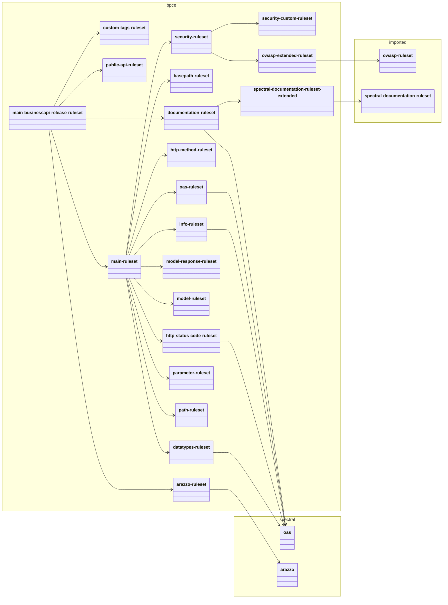

# Rulesets Organization

## Hierarchy

```mermaid
classDiagram
direction LR

namespace bpce {

    class arazzo-ruleset

    class basepath-ruleset
    class custom-tags-ruleset
    class datatypes-ruleset

    class http-method-ruleset
    class http-status-code-ruleset
    class info-ruleset

    class model-response-ruleset
    class model-ruleset
    class oas-ruleset

    class parameter-ruleset
    class path-ruleset
    class public-api-ruleset

    class security-custom-ruleset
    class security-ruleset

    class documentation-ruleset
    class spectral-documentation-ruleset-extended

    class owasp-extended-ruleset

    class main-ruleset
    class main-businessapi-release-ruleset
}

namespace spectral {
    class oas
    class arazzo
}

namespace imported {
    class owasp-ruleset
    class spectral-documentation-ruleset
}

link main-ruleset "./main-ruleset.yaml"
link arazzo-ruleset "./arazzo-ruleset.yaml"

main-ruleset --> oas-ruleset
main-ruleset --> info-ruleset
main-ruleset --> datatypes-ruleset
main-ruleset --> basepath-ruleset
main-ruleset --> path-ruleset
main-ruleset --> http-method-ruleset
main-ruleset --> http-status-code-ruleset
main-ruleset --> parameter-ruleset
main-ruleset --> model-ruleset
main-ruleset --> model-response-ruleset
main-ruleset --> security-ruleset

datatypes-ruleset --> oas
http-status-code-ruleset --> oas
info-ruleset --> oas
oas-ruleset --> oas

arazzo-ruleset --> arazzo

spectral-documentation-ruleset-extended --> spectral-documentation-ruleset

security-ruleset --> security-custom-ruleset
security-ruleset --> owasp-extended-ruleset

owasp-extended-ruleset --> owasp-ruleset

main-businessapi-release-ruleset --> documentation-ruleset
main-businessapi-release-ruleset --> public-api-ruleset
main-businessapi-release-ruleset --> main-ruleset
main-businessapi-release-ruleset --> arazzo-ruleset
main-businessapi-release-ruleset --> custom-tags-ruleset

documentation-ruleset --> spectral-documentation-ruleset-extended
documentation-ruleset --> oas

```
